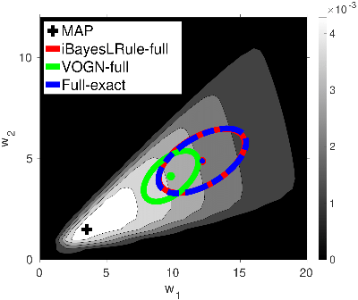

Code for ICML 2020 paper on [Handling the Positive-Definite Constraint in the Bayesian Learning Rule](https://arxiv.org/abs/2002.10060)
   
Efficient Riemannian/Natural Gradient Variational Inference
* To-do List:
  * Added [slides](https://github.com/yorkerlin/iBayesLRule/blob/master/slides.pdf) of the talk 
  * To add a [link] of the ICML talk
  * Added a Python [implementatoin](https://github.com/yorkerlin/iBayesLRule/tree/master/inverse_gauss/) of the implicit reparameterization gradient for inverse Gaussian distribution (See Appendix H.1)
  * Added a Matlab [implementation](https://github.com/yorkerlin/iBayesLRule/tree/master/gauss) about Gaussian approximation (See Appendix E) 
  
  * Added a Matlab [implementation](https://github.com/yorkerlin/iBayesLRule/) about  MoG approximation (See Appendix J)
     
 examples of MoG approximation:
 [star](https://github.com/yorkerlin/iBayesLRule/blob/master/MoG/star.m), [double-banana](https://github.com/yorkerlin/iBayesLRule/blob/master/MoG/doublebanana.m), [Laplace](https://github.com/yorkerlin/iBayesLRule/blob/master/MoG/laplace.m), [BNN](https://github.com/yorkerlin/iBayesLRule/blob/master/MoG/bnn.m), [mixture of Ts](https://github.com/yorkerlin/iBayesLRule/blob/master/MoG/mixT_demo20d.m)
  * To add a Matlab [implementation](https://github.com/yorkerlin/iBayesLRule/) about Gamma approximation (See Appendix F)
  * To add a Python [implementation](https://github.com/yorkerlin/iBayesLRule/) for the Adam-like update using a factorized/diagonal Gaussian approximation (See Appendix E.3)

